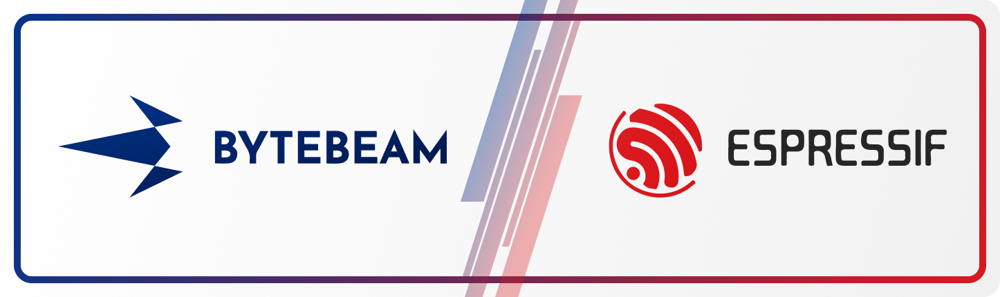

# Bytebeam ESP IDF SDK

    

---

This SDK consist of components that can be used for connecting ESP devices to [Bytebeam](https://bytebeam.io/) IoT platform

## Features :-

- Efficiently send data to cloud.
- Receive commands from the cloud, execute them and update progress of execution.
- Download Firmware images from cloud in case of OTA updates being triggered from cloud.

## What's included in the SDK :-

- **components/bytebeam_esp_sdk** :-  This section contains source code for various functions that can be used by applications for interacting with Bytebeam platform. 
- **examples** :- This folder conatins demo application's which demonstrates establishing secure connection with Bytebeam platform. Also, it demonstrates periodic data pushing and receiving actions.
- **provisioning** :- This folder contains application for pushing device config data to file system of device (say SPIFFS).

## Dependencies :-

- [ESP-IDF](https://docs.espressif.com/projects/esp-idf/en/latest/esp32/get-started/) 
- ESP32 Dev Board

We recommend to install the latest version of the ESP-IDF.

## SDK Setup and Integration :-

This SDK can be integrated with new as well as existing ESP projects. Follow the [instruction guide](https://bytebeam.io/docs/esp-idf) for setting up and integrating SDK with your projects. 

## Community :-

- Follow us on [Twitter](https://twitter.com/bytebeamhq)
- Connect with us on [LinkedIn](https://www.linkedin.com/company/bytebeam/)
- Read our official [Blog](https://bytebeam.io/blog/)

## Contributing :-

Contributions are welcome! Not only you’ll encourage the development of the SDK, but you’ll also learn how to best use the SDK and probably some C too.

See [the contributing guide](CONTRIBUTING.md) for detailed instructions on how to get started with the SDK. Please follow the [code of conduct](CODE_OF_CONDUCT.md) while contributing.

## License :-

This SDK is licensed under the Apache License, Version 2.0 (see [LICENSE](LICENSE) for details).